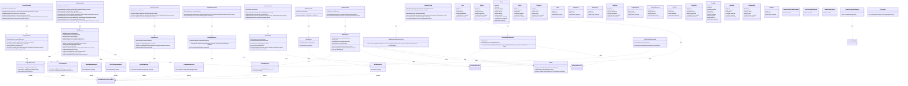

# Backend Application UML Diagram

## Class Diagram

```mermaid
classDiagram
        class GameTrackApiApplication {
            +static void main(String[] args)
        }


        class AuthController {
            -AuthService authService
            +ResponseEntity~UserDto~ register(RegisterRequest request)
            +ResponseEntity~Map~String,Object~~ login(LoginRequest request)
        }

        class ProjectController {
            -ProjectService projectService
            +ResponseEntity~ProjectDto~ createProject(CreateProjectRequest request)
            +ResponseEntity~List~ProjectDto~~ getProjects()
            +ResponseEntity~ProjectDto~ getProject(Integer projectId)
            +ResponseEntity~ProjectDto~ updateProject(Integer projectId, UpdateProjectRequest request)
            +ResponseEntity~Void~ archiveProject(Integer projectId)
        }

        class TaskController {
            -TaskService taskService
            +ResponseEntity~TaskDto~ createTask(CreateTaskRequest request)
            +ResponseEntity~List~TaskDto~~ getTasks()
            +ResponseEntity~TaskDto~ getTask(Integer taskId)
            +ResponseEntity~TaskDto~ updateTask(Integer taskId, UpdateTaskRequest request)
            +ResponseEntity~Void~ deleteTask(Integer taskId)
            +ResponseEntity~Void~ assignTask(Integer taskId, AssignTaskRequest request)
            +ResponseEntity~Void~ removeAssignee(Integer taskId)
            +ResponseEntity~Void~ changeStatus(Integer taskId, ChangeStatusRequest request)
        }

        class UserController {
            -UserService userService
            +ResponseEntity~UserDto~ getUserById(Integer userId)
            +ResponseEntity~List~UserDto~~ getAllUsers()
            +ResponseEntity~UserDto~ updateUser(Integer userId, UpdateUserRequest request)
            +ResponseEntity~Void~ deleteUser(Integer userId)
        }

        class SprintController {
            -SprintService sprintService
            +ResponseEntity~SprintDto~ getSprint(Integer sprintId)
            +ResponseEntity~SprintDto~ updateSprint(Integer sprintId, UpdateSprintRequest request)
            +ResponseEntity~Void~ deleteSprint(Integer sprintId)
        }

        class CommentController {
            -CommentService commentService
            +ResponseEntity~CommentDto~ updateComment(Integer commentId, UpdateCommentRequest request)
            +ResponseEntity~Void~ deleteComment(Integer commentId)
        }

        class RoleController {
            -RoleService roleService
            +ResponseEntity~List~RoleDto~~ getRoles()
        }
    

        class AuthService {
            -UserDetailsService userDetailsService
            -JwtUtil jwtUtil
            -PasswordEncoder passwordEncoder
            -UserRepository userRepository
            +UserDto register(RegisterRequest request)
            +Map~String,Object~ login(LoginRequest request)
            +User getCurrentUser()
        }

        class ProjectService {
            -ProjectRepository projectRepository
            +ProjectDto createProject(CreateProjectRequest request)
            +ProjectDto getProjectById(Integer projectId)
            +List~ProjectDto~ getAllProjects()
            +ProjectDto updateProject(Integer projectId, UpdateProjectRequest request)
            +void archiveProject(Integer projectId)
        }

        class TaskService {
            -TaskRepository taskRepository
            -ProjectRepository projectRepository
            -UserRepository userRepository
            -TaskStatusRepository taskStatusRepository
            -TaskPriorityRepository taskPriorityRepository
            +TaskDto createTask(CreateTaskRequest request)
            +TaskDto getTaskById(Integer taskId)
            +List~TaskDto~ getAllTasks()
            +TaskDto updateTask(Integer taskId, UpdateTaskRequest request)
            +void deleteTask(Integer taskId)
            +void assignTask(Integer taskId, Integer userId)
            +void removeAssignee(Integer taskId)
            +void changeStatus(Integer taskId, Integer statusId)
        }

        class UserService {
            -UserRepository userRepository
            -PasswordEncoder passwordEncoder
            +UserDto getUserById(Integer userId)
            +List~UserDto~ getAllUsers()
            +UserDto updateUser(Integer userId, UpdateUserRequest request)
            +void deleteUser(Integer userId)
        }

        class SprintService {
            -SprintRepository sprintRepository
            +SprintDto getSprintById(Integer sprintId)
            +SprintDto updateSprint(Integer sprintId, UpdateSprintRequest request)
            +void deleteSprint(Integer sprintId)
        }

        class CommentService {
            -CommentRepository commentRepository
            +CommentDto updateComment(Integer commentId, UpdateCommentRequest request)
            +void deleteComment(Integer commentId)
        }

        class RoleService {
            -RoleRepository roleRepository
            +List~RoleDto~ getRoles()
        }
    

        class User {
            -Integer id
            -String email
            -String fullName
            -String passwordHash
            -LocalDateTime createdAt
            +getter/setter methods
        }

        class Project {
            -Integer id
            -String name
            -String description
            -Boolean isArchived
            -LocalDateTime createdAt
            +getter/setter methods
        }

        class Task {
            -Integer id
            -String title
            -String description
            -Integer projectId
            -Integer sprintId
            -Integer statusId
            -Integer priorityId
            -LocalDateTime createdAt
            -LocalDateTime updatedAt
            +getter/setter methods
        }

        class Sprint {
            -Integer id
            -Integer projectId
            -String name
            -LocalDate startDate
            -LocalDate endDate
            +getter/setter methods
        }

        class Comment {
            -Integer id
            -Integer taskId
            -Integer userId
            -String content
            -LocalDateTime createdAt
            +getter/setter methods
        }

        class Role {
            -Integer id
            -String name
            +getter/setter methods
        }

        class TaskStatus {
            -Integer id
            -String name
            +getter/setter methods
        }

        class TaskPriority {
            -Integer id
            -String name
            +getter/setter methods
        }

        class AuditLog {
            -Integer id
            -Integer taskId
            -Integer oldStatusId
            -Integer newStatusId
            -LocalDateTime changedAt
            +getter/setter methods
        }
    

        class UserRepository {
            +Optional~User~ findByEmail(String email)
            +List~User~ findAll()
        }

        class ProjectRepository {
            +List~Project~ findByIsArchivedFalse()
            +List~Project~ findByUserId(Integer userId)
            +void archiveProject(Integer id)
        }

        class TaskRepository {
            +List~Task~ findByProjectId(Integer projectId)
            +List~Task~ findByAssigneeId(Integer assigneeId)
        }

        class SprintRepository {
            +List~Sprint~ findByProjectId(Integer projectId)
        }

        class CommentRepository {
            +List~Comment~ findByTaskId(Integer taskId)
        }

        class RoleRepository {
            +List~Role~ findAll()
        }

        class TaskStatusRepository {
            +List~TaskStatus~ findAll()
        }

        class TaskPriorityRepository {
            +List~TaskPriority~ findAll()
        }
    

        class LoginRequest {
            -String email
            -String password
            +getter/setter methods
        }

        class RegisterRequest {
            -String email
            -String fullName
            -String password
            +getter/setter methods
        }

        class UserDto {
            -Integer id
            -String email
            -String fullName
            +getter/setter methods
        }

        class ProjectDto {
            -Integer id
            -String name
            -String description
            -Boolean isArchived
            -LocalDateTime createdAt
            +getter/setter methods
        }

        class TaskDto {
            -Integer id
            -String title
            -String description
            -String status
            -String priority
            -UserDto assignee
            -Integer projectId
            -Integer sprintId
            +getter/setter methods
        }

        class SprintDto {
            -Integer id
            -Integer projectId
            -String name
            -LocalDate startDate
            -LocalDate endDate
            +getter/setter methods
        }

        class CommentDto {
            -Integer id
            -Integer taskId
            -UserDto author
            -String content
            -LocalDateTime createdAt
            +getter/setter methods
        }

        class RoleDto {
            -Integer id
            -String name
            +getter/setter methods
        }
    
        class JwtUtil {
            +String generateToken(UserDetails userDetails)
            +String extractUsername(String token)
            +Boolean validateToken(String token, UserDetails userDetails)
        }

        class JwtAuthenticationFilter {
            -JwtUtil jwtUtil
            -UserDetailsService userDetailsService
            +void doFilterInternal(HttpServletRequest request, HttpServletResponse response, FilterChain chain)
        }

        class JwtAuthenticationEntryPoint {
            +void commence(HttpServletRequest request, HttpServletResponse response, AuthenticationException authException)
        }

        class UserDetailsServiceImpl {
            -UserRepository userRepository
            +UserDetails loadUserByUsername(String username)
        }
    

        class ResourceNotFoundException {
            -String message
        }

        class UnauthorizedException {
            -String message
        }

        class ValidationException {
            -String message
        }
    

        class SecurityConfig {
            -JwtAuthenticationEntryPoint jwtAuthenticationEntryPoint
            -JwtAuthenticationFilter jwtAuthenticationFilter
            +PasswordEncoder passwordEncoder()
            +AuthenticationManager authenticationManager(AuthenticationConfiguration config)
            +SecurityFilterChain filterChain(HttpSecurity http)
            +CorsConfigurationSource corsConfigurationSource()
        }

        class CorsConfig {
            +CorsConfigurationSource corsConfigurationSource()
        }
    

    %% Relationships
    GameTrackApiApplication ..> securityConfig : uses

    %% Controller relationships
    AuthController ..> AuthService : uses
    ProjectController ..> ProjectService : uses
    TaskController ..> TaskService : uses
    UserController ..> UserService : uses
    SprintController ..> SprintService : uses
    CommentController ..> CommentService : uses
    RoleController ..> RoleService : uses

    %% Service relationships
    AuthService ..> UserRepository : uses
    AuthService ..> PasswordEncoder : uses
    AuthService ..> JwtUtil : uses
    AuthService ..> UserDetailsService : uses

    ProjectService ..> ProjectRepository : uses

    TaskService ..> TaskRepository : uses
    TaskService ..> ProjectRepository : uses
    TaskService ..> UserRepository : uses
    TaskService ..> TaskStatusRepository : uses
    TaskService ..> TaskPriorityRepository : uses

    UserService ..> UserRepository : uses
    UserService ..> PasswordEncoder : uses

    SprintService ..> SprintRepository : uses

    CommentService ..> CommentRepository : uses

    RoleService ..> RoleRepository : uses

    %% Repository relationships
    UserRepository ..|> JpaRepository~User, Integer~ : extends
    ProjectRepository ..|> JpaRepository~Project, Integer~ : extends
    TaskRepository ..|> JpaRepository~Task, Integer~ : extends
    SprintRepository ..|> JpaRepository~Sprint, Integer~ : extends
    CommentRepository ..|> JpaRepository~Comment, Integer~ : extends
    RoleRepository ..|> JpaRepository~Role, Integer~ : extends
    TaskStatusRepository ..|> JpaRepository~TaskStatus, Integer~ : extends
    TaskPriorityRepository ..|> JpaRepository~TaskPriority, Integer~ : extends


    %% Security relationships
    JwtAuthenticationFilter ..> JwtUtil : uses
    JwtAuthenticationFilter ..> UserDetailsService : uses
    UserDetailsServiceImpl ..> UserRepository : uses
    SecurityConfig ..> JwtAuthenticationEntryPoint : uses
    SecurityConfig ..> JwtAuthenticationFilter : uses
    SecurityConfig ..> PasswordEncoder : uses
```