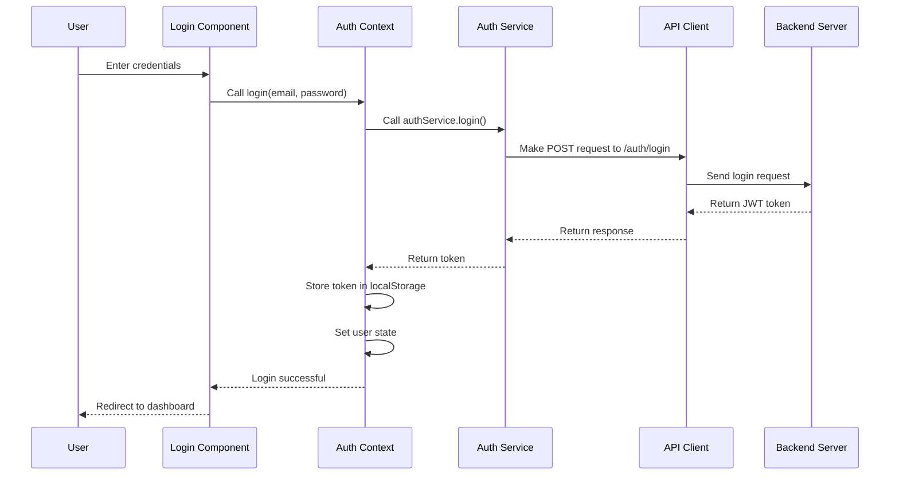

# Frontend Application UML Diagram

## Class Diagram

```mermaid
classDiagram
    class App {
        +AuthProvider authProvider
        +BrowserRouter router
        +Routes routes
    }

    class AuthProvider {
        -User user
        -String token
        +login(email, password)
        +register(email, fullName, password)
        +logout()
        +isAuthenticated()
    }

    class ApiClient {
        +String baseURL
        +Object headers
        +get(url)
        +post(url, data)
        +put(url, data)
        +delete(url)
    }

    class AuthService {
        +register(userData)
        +login(credentials)
    }

    class ProjectService {
        +getAll()
        +getById(projectId)
        +create(projectData)
        +update(projectId, projectData)
        +archive(projectId)
        +addMember(projectId, memberId)
        +createSprint(projectId, sprintData)
        +getKanban(projectId)
    }

    class TaskService {
        +getAll()
        +getById(taskId)
        +create(taskData)
        +update(taskId, taskData)
        +delete(taskId)
        +assign(taskId, userId)
        +removeAssignee(taskId)
        +changeStatus(taskId, statusId)
        +getComments(taskId)
    }

    class UserService {
        +getAll()
        +getById(userId)
        +update(userId, userData)
        +delete(userId)
        +getRoles(userId)
        +assignRole(userId, roleId)
    }

    class RoleService {
        +getAll()
    }

    class SprintService {
        +getById(sprintId)
        +update(sprintId, sprintData)
        +delete(sprintId)
    }

    class Layout {
        +Navbar navbar
        +MainContent mainContent
        +Footer footer
    }

    class Navbar {
        +String brand
        +Array~NavMenu~ navMenus
    }

    class Login {
        -String email
        -String password
        -String error
        +handleSubmit(event)
    }

    class Register {
        -String email
        -String fullName
        -String password
        -String confirmPassword
        -String error
        +handleSubmit(event)
    }

    class Dashboard {
        +User user
        +render()
    }

    class Projects {
        -Array~Project~ projects
        -Boolean loading
        -String error
        -Boolean showForm
        -Object newProject
        +fetchProjects()
        +handleCreateProject(event)
        +handleArchiveProject(projectId)
    }

    class Tasks {
        -Array~Task~ tasks
        -Array~Project~ projects
        -Array~User~ users
        -Boolean loading
        -String error
        -Boolean showForm
        -Object newTask
        +fetchData()
        +handleCreateTask(event)
        +handleDeleteTask(taskId)
        +handleAssignTask(taskId, userId)
        +handleChangeStatus(taskId, statusId)
    }

    class Kanban {
        -KanbanData kanbanData
        -Boolean loading
        -String error
        +fetchKanbanData()
    }

    class Project {
        +int id
        +String name
        +String description
        +Date createdAt
        +Date updatedAt
        +Boolean isArchived
    }

    class Task {
        +int id
        +String title
        +String description
        +String status
        +String priority
        +User assignee
        +int projectId
        +int sprintId
        +Date createdAt
        +Date updatedAt
    }

    class User {
        +int id
        +String email
        +String fullName
    }

    class KanbanColumn {
        +int id
        +String name
        +Array~Task~ tasks
    }

    %% Relationships
    App ||--|| AuthProvider : uses
    App ||--|| ApiClient : uses
    App ||--|| Layout : renders
    AuthProvider ||--|| UserService : uses
    ApiClient ||--|| AuthService : implements
    ApiClient ||--|| ProjectService : implements
    ApiClient ||--|| TaskService : implements
    ApiClient ||--|| UserService : implements
    ApiClient ||--|| RoleService : implements
    ApiClient ||--|| SprintService : implements
    Layout ||--|| Navbar : contains
    Layout ||--|| Dashboard : renders
    Layout ||--|| Projects : renders
    Layout ||--|| Tasks : renders
    Layout ||--|| Kanban : renders
    Login ..|> AuthProvider : accesses
    Register ..|> AuthProvider : accesses
    Dashboard ..|> AuthProvider : accesses
    Projects ..|> ProjectService : uses
    Projects ..|> Project : manages
    Tasks ..|> TaskService : uses
    Tasks ..|> UserService : uses
    Tasks ..|> ProjectService : uses
    Tasks ..|> Task : manages
    Kanban ..|> ProjectService : uses
    Kanban ..|> KanbanColumn : displays
    KanbanColumn ||--o{ Task : contains
```

## Component Diagram

```mermaid
componentDiagram
    component "React App" as App {
        component "Auth Context" as AuthCtx
        component "Routing" as Router
        component "Layout" as Layout
    }
    
    component "API Services" as ApiSvc {
        component "Auth Service" as AuthSvc
        component "Project Service" as ProjSvc
        component "Task Service" as TaskSvc
        component "User Service" as UserSvc
        component "Role Service" as RoleSvc
        component "Sprint Service" as SprintSvc
    }
    
    component "Pages" as Pages {
        component "Dashboard" as Dashboard
        component "Projects" as Projects
        component "Tasks" as Tasks
        component "Kanban" as Kanban
    }
    
    component "Auth Components" as AuthComps {
        component "Login" as Login
        component "Register" as Register
    }
    
    component "UI Components" as UIComps {
        component "Navbar" as Navbar
        component "Footer" as Footer
    }

    App --> AuthCtx
    App --> Router
    App --> Layout
    
    Router --> Pages
    Router --> AuthComps
    
    Layout --> UIComps
    
    Pages --> ApiSvc
    AuthComps --> ApiSvc
    AuthSvc --> AuthCtx
    
    ApiSvc --> AuthSvc
    ApiSvc --> ProjSvc
    ApiSvc --> TaskSvc
    ApiSvc --> UserSvc
    ApiSvc --> RoleSvc
    ApiSvc --> SprintSvc
```

## Sequence Diagram - Login Flow

